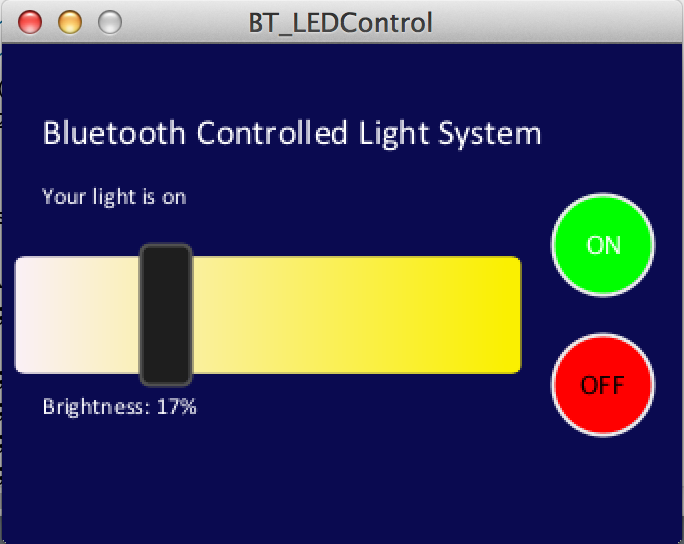
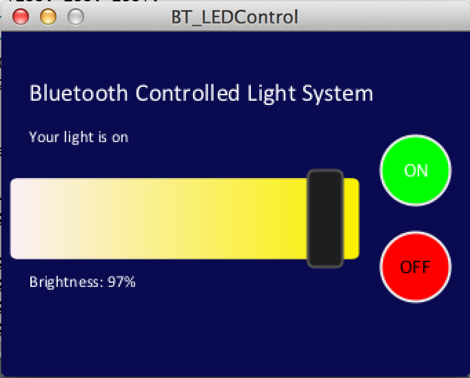
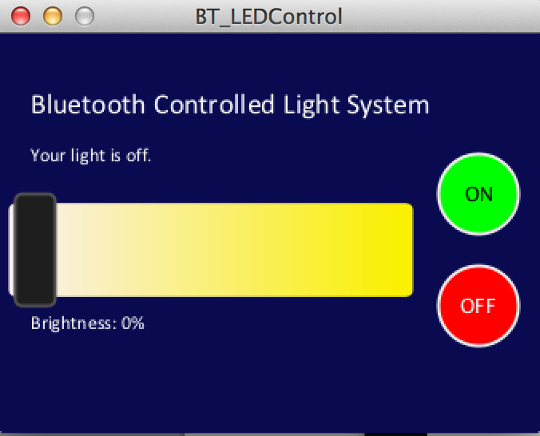

# IoT-Light-System
These programs are used to interface with an HC-05 Bluetooth module and Arduino Uno.

The Processing GUI sends commands via Bluetooth connection to the HC-05, which then
serially transmits the data to the Arduino. The Arduino uses this data to set the 
voltage level of one of its output pins, which is connected to an LED or some other
type of light. 

### If you are in search of a solution for implementing a slider bar in Processing, then this repo will be very useful for you!

The GUI is shown below.

